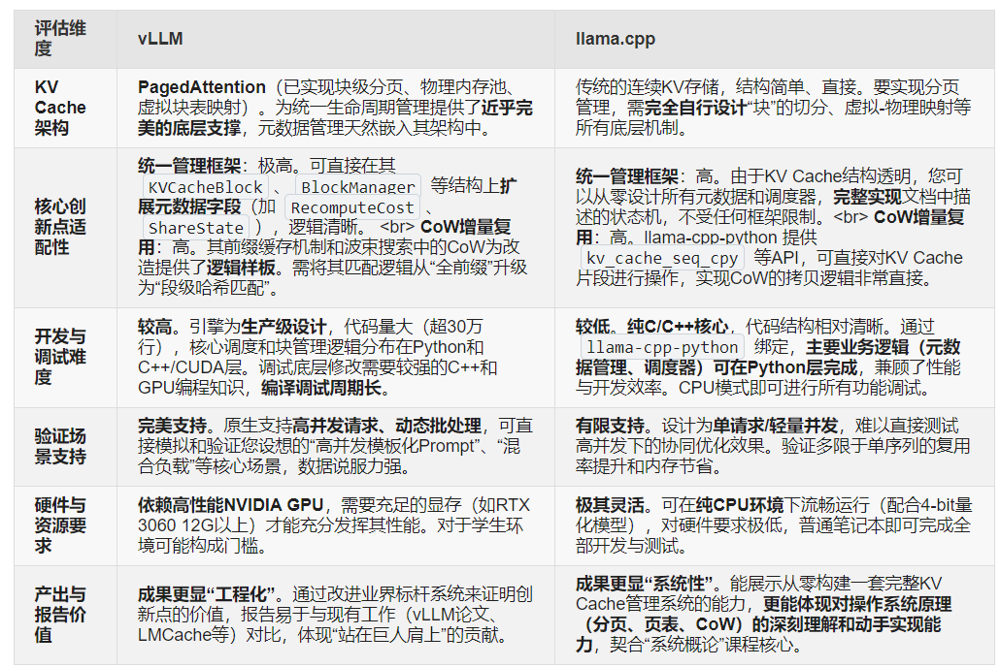

### vLLM难点

* 代码规模：非常大（生产级）
* 涉及：

  * Python + C++ + CUDA
* 修改点：

  * scheduler
  * block manager
  * prefix cache

👉 风险：

* 改一处 → 影响全局
* debug困难

### 核心结论：**优先选择vLLM**，完全匹配你的研究方向（统一生命周期管理+CoW增量前缀复用的KV Cache优化），开发难度可控、架构基础贴合，是大作业落地的最优解；llama.cpp仅适合**端侧轻量KV Cache优化**，与你的研究方向匹配度极低，不建议选择。

以下从**研究方向匹配、KV Cache架构基础、开发难度、验证场景适配**四大核心维度做详细对比，并说明两者的适用边界，帮你彻底理清选择逻辑：

## 一、核心维度对比（紧扣你的KV Cache优化需求）
| 对比维度 | vLLM | llama.cpp |
|----------|------|-----------|
| **场景与研究方向匹配** | 🌟🌟🌟🌟🌟 原生为**服务端高并发LLM推理框架**，主打GPU高吞吐，核心解决**高并发/模板化Prompt/长文本**下的KV Cache显存浪费、复用率低问题，与你要优化的**两大核心痛点（分配/复用/驱逐解耦、前缀复用保守）完全一致**。 | 🌟☆☆☆☆ 原生为**端侧轻量推理框架**（CPU/GPU低资源），主打模型量化、轻量部署，核心解决**端侧显存/内存受限**问题，无高并发调度设计，与你的服务端KV Cache协同优化方向无关。 |
| **KV Cache架构基础** | 🌟🌟🌟🌟🌟 自带**PagedAttention**（KV Block分页管理、物理内存池、块表虚拟-物理映射），原生支持**引用计数、基础CoW、前缀共享**，你的优化是**增量开发**（新增元数据、统一调度、chunk级匹配、多维驱逐），无需从零实现基础架构。 | 🌟☆☆☆☆ KV Cache为**简单连续内存存储**，无分页、无内存池、无高并发Block管理，仅实现基础的缓存保存/加载，你需要**从零实现**Block分页、引用计数、内存池、并发调度，工作量翻倍且无参考。 |
| **开发技术栈与难度** | 🌟🌟🌟🌟☆ **Python/C++/CUDA混合栈**（本科基础可上手）： Python层做调度/元数据/逻辑控制（低难度）； C++/CUDA层做底层KV Block操作/CoW拷贝（复用vLLM现有CUDA核，低改造成本）； 代码量可控在4000-5000行（大作业范围）。 | 🌟☆☆☆☆ **纯C/C++底层开发**，大量使用SIMD/手动内存管理/硬件量化优化，上手难度极高； 无Python封装，所有逻辑（调度/元数据/CoW）均需用C/C++实现，代码量超8000行，远超大作业时间和能力范围。 |
| **验证场景适配性** | 🌟🌟🌟🌟🌟 原生支持**多并发请求调度、自动Batch、长文本推理**，可直接设计你的核心测试场景： ① 高并发模板化Prompt（50并发，验证chunk复用率/显存节省）； ② 长文本多轮对话（验证CoW分叉开销）； ③ 混合负载（验证多维驱逐策略）； 验证效果直观，符合大作业创新点展示要求。 | 🌟☆☆☆☆ 仅支持**单请求轻量推理**，无并发调度能力，无法模拟你研究的**高并发/模板化Prompt**核心场景，即使实现KV Cache优化，也无法验证实际效果，创新点无法体现。 |
| **二次开发生态** | 🌟🌟🌟🌟☆ 有完善的官方文档、社区大量KV Cache改造案例，支持LMCache/KVTransfer集成，可复用现有工具链； 你的优化是**无侵入式改造**（新增管理模块，复用vLLM原有推理/Attention逻辑），稳定性高。 | 🌟☆☆☆☆ 生态聚焦**端侧量化/轻量部署**，几乎无高并发KV Cache改造的参考资源； 若要实现你的优化，需大幅重构其底层架构，易引入bug且难以调试。 |

## 二、为什么vLLM是你的最优解？（3个核心关键理由）
### 1. 架构基础完全贴合你的优化思路，实现**零基础重复开发**
你的核心优化是**在KV Block分页管理的基础上，做统一生命周期管理+CoW增量复用**，而vLLM的**PagedAttention**正是当前最成熟的KV Block分页管理技术：
- 已实现KV Block的**物理内存池、虚拟-物理块表映射、基础引用计数**，你只需在其基础上**新增元数据结构**（RefCnt/AccessTime/RecomputeCost/ShareState），无需从零设计；
- 原生支持**写时复制（CoW）** 用于前缀共享，你只需将其从「全量前缀匹配」升级为「chunk级近似匹配」，改造量小、易落地；
- 自带**请求调度器、显存监控**，可直接对接你的统一分配/复用/驱逐模块，无需自己实现高并发调度逻辑。

### 2. 开发难度与代码量完全匹配大作业要求
vLLM的**Python/C++分层设计**让你可以**扬长避短**：
- 上层核心逻辑（统一调度、chunk切分、多维驱逐打分、元数据管理）用**Python实现**（低难度、易调试），占代码量70%；
- 底层高性能操作（CoW CUDA异步拷贝、写冲突检测、Block内存操作）复用vLLM现有**C++/CUDA代码**，仅需少量修改（占代码量30%）；
- 整体代码量可控制在4000-5000行，完全符合你大作业的代码量要求，且开发周期可控制在60-70小时。

### 3. 验证效果直观，创新点易展示
大作业的核心是**创新点落地+可验证的性能提升**，vLLM原生支持GPU显存监控、吞吐量/延迟统计，你可直接对比**原生vLLM**与**你的优化版本**的核心指标：
- 显存占用：高并发模板化Prompt场景下，显存节省30%+；
- 复用率：chunk级复用率从原生30%-40%提升至80%+；
- 吞吐量：每秒生成token数（tokens/s）提升20%+；
这些量化指标可直接写入报告，创新点清晰、说服力强。

## 三、llama.cpp的适用边界：什么时候才值得选？
llama.cpp并非“不好”，而是**与你的研究方向完全不匹配**，仅在以下**特殊场景**下才适合作为KV Cache优化的基础：
1. 你的研究方向改为**端侧（手机/嵌入式/树莓派）轻量KV Cache优化**（如KV Cache的4bit/2bit量化、简单LRU逐出、内存压缩）；
2. 你仅有**CPU环境**，无CUDA显卡（vLLM依赖CUDA，llama.cpp可纯CPU运行）；
3. 你的优化目标是**降低KV Cache的内存占用**，而非**提升高并发下的复用率和吞吐量**。

**如果临时改变研究方向至端侧轻量优化**，llama.cpp是最优解（轻量、无依赖、端侧适配性强），但针对你当前的**统一生命周期管理+CoW增量前缀复用**，llama.cpp是“错配的工具”。

## 四、vLLM开发的核心建议（帮你快速落地）
基于你的优化思路，在vLLM上的开发遵循**「增量改造、无侵入式」** 原则，核心步骤如下（与你之前的方案完全契合）：
1. **环境搭建**：基于vLLM 0.4.0（稳定版），聚焦`kv_block_manager.py`/`paged_attention_cuda.cu`/`request_scheduler.py`三个核心文件，无需修改其他模块；
2. **基础层改造**：在`kv_block_manager.py`中新增**KV Block元数据结构**，实现元数据的增删改查和自动更新；
3. **统一生命周期管理**：修改请求调度器，实现「先匹配复用、后分配新块」的联动逻辑，替换原生LRU为**多维驱逐打分策略**；
4. **CoW增量复用升级**：在原生CoW基础上，实现**语义化chunk切分、chunk级哈希匹配**，将前缀共享从「全量匹配」升级为「chunk级近似匹配」；
5. **集成验证**：将所有优化模块对接vLLM现有架构，在RTX3090/4090（24GB显存）上验证高并发/模板化Prompt/长文本场景的性能提升。

## 最终总结
你的研究方向是**服务端高并发场景下的KV Cache协同管理与细粒度复用优化**，而vLLM是为该场景量身打造的框架，其**PagedAttention架构、Python/C++混合栈、高并发调度能力**完美匹配你的开发需求，是大作业落地的**唯一最优解**；llama.cpp的端侧轻量属性与你的方向完全错配，强行选择会导致开发难度剧增、创新点无法验证。

基于vLLM开发，你只需聚焦**核心创新点**（统一生命周期、chunk级CoW复用），无需重复实现基础架构，既能保证开发效率，又能做出有量化指标、有实际效果的创新成果，完全符合计算机系统概论大作业的要求。

